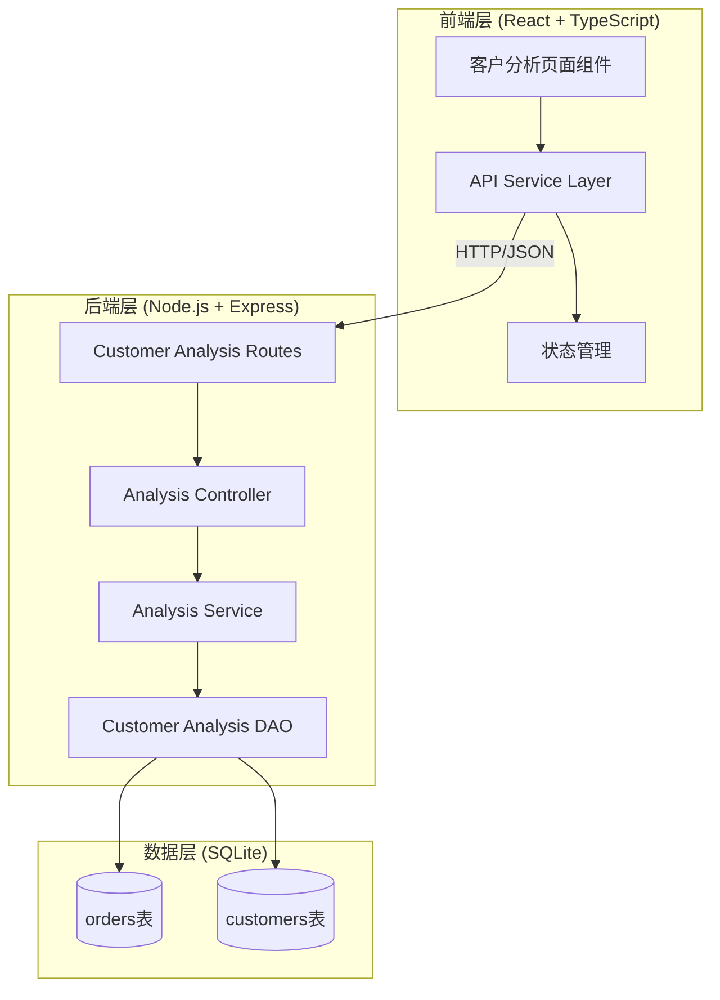

# Design Document: Customer Behavior Analysis

## Overview

客户行为分析功能是外贸订单管理系统的新增模块，旨在为业务人员提供以客户为中心的深度数据分析能力。该功能通过分析现有订单数据，计算客户的下单频率、采购习惯等关键指标，帮助业务团队识别高价值客户、优化客户关系管理策略。

本设计采用前后端分离架构，前端使用 React + TypeScript + Ant Design 构建用户界面，后端使用 Node.js + Express 提供 RESTful API，数据存储基于现有的 SQLite 数据库。

核心设计原则：
- **数据驱动**：所有分析指标基于现有订单数据实时计算
- **性能优化**：使用数据库索引和聚合查询提升查询效率
- **可扩展性**：模块化设计便于后续添加新的分析维度
- **用户友好**：清晰的数据可视化和交互设计

## Architecture

### System Architecture



### Component Layers

**前端层**：
- **CustomerAnalysis 页面组件**：主容器组件，管理页面状态和布局
- **CustomerList 组件**：客户列表展示，支持排序和分页
- **CustomerFilter 组件**：筛选条件面板
- **CustomerDetail 组件**：客户详细分析视图（抽屉或模态框）
- **AnalysisCharts 组件**：数据可视化图表（使用 @ant-design/charts）
- **customerAnalysisService**：封装 API 调用逻辑

**后端层**：
- **customerAnalysisRoutes**：定义 API 路由端点
- **CustomerAnalysisController**：处理 HTTP 请求和响应
- **CustomerAnalysisService**：业务逻辑层，计算分析指标
- **CustomerAnalysisDAO**：数据访问层，执行数据库查询

**数据层**：
- 复用现有的 orders 和 customers 表
- 利用现有索引（company_name, order_date, country）
- 不需要新增表结构

## Components and Interfaces

### Frontend Components

#### 1. CustomerAnalysis (主页面组件)

```typescript
interface CustomerAnalysisProps {}

interface CustomerAnalysisState {
  customers: CustomerMetrics[];
  loading: boolean;
  filters: FilterCriteria;
  pagination: PaginationConfig;
  selectedCustomer: string | null;
}

const CustomerAnalysis: React.FC<CustomerAnalysisProps> = () => {
  // 管理客户列表、筛选、分页状态
  // 协调子组件交互
}
```

#### 2. CustomerList (客户列表组件)

```typescript
interface CustomerListProps {
  customers: CustomerMetrics[];
  loading: boolean;
  pagination: PaginationConfig;
  onPageChange: (page: number, pageSize: number) => void;
  onSort: (field: string, order: 'ascend' | 'descend') => void;
  onCustomerClick: (companyName: string) => void;
}

const CustomerList: React.FC<CustomerListProps> = (props) => {
  // 使用 Ant Design Table 组件
  // 支持列排序、分页
}
```

#### 3. CustomerFilter (筛选组件)

```typescript
interface CustomerFilterProps {
  filters: FilterCriteria;
  onFilterChange: (filters: FilterCriteria) => void;
  onReset: () => void;
}

const CustomerFilter: React.FC<CustomerFilterProps> = (props) => {
  // 使用 Ant Design Form 组件
  // 提供国家、客户等级、新老客户等筛选项
}
```

#### 4. CustomerDetail (客户详情组件)

```typescript
interface CustomerDetailProps {
  companyName: string;
  visible: boolean;
  onClose: () => void;
}

const CustomerDetail: React.FC<CustomerDetailProps> = (props) => {
  // 使用 Ant Design Drawer 组件
  // 展示客户详细分析数据和图表
}
```

### Backend API Endpoints

#### 1. GET /api/customer-analysis/customers

获取客户列表及关键指标

**Query Parameters:**
```typescript
interface GetCustomersQuery {
  page?: number;           // 页码，默认1
  pageSize?: number;       // 每页数量，默认20
  country?: string;        // 国家筛选
  customerLevel?: string;  // 客户等级筛选 (A/B/C)
  customerType?: string;   // 新老客户筛选 (新客户/老客户)
  sortBy?: string;         // 排序字段
  sortOrder?: 'asc' | 'desc'; // 排序方向
}
```

**Response:**
```typescript
interface GetCustomersResponse {
  success: boolean;
  data: {
    customers: CustomerMetrics[];
    total: number;
    page: number;
    pageSize: number;
  };
}
```

#### 2. GET /api/customer-analysis/customers/:companyName

获取单个客户的详细分析数据

**Response:**
```typescript
interface GetCustomerDetailResponse {
  success: boolean;
  data: CustomerDetailAnalysis;
}
```

### Backend Services

#### CustomerAnalysisService

```typescript
class CustomerAnalysisService {
  /**
   * 获取客户列表及指标
   */
  async getCustomerMetrics(query: GetCustomersQuery): Promise<{
    customers: CustomerMetrics[];
    total: number;
  }>;

  /**
   * 获取单个客户详细分析
   */
  async getCustomerDetail(companyName: string): Promise<CustomerDetailAnalysis>;

  /**
   * 计算客户下单频率
   */
  private calculateOrderFrequency(orders: Order[]): OrderFrequencyMetrics;

  /**
   * 分析客户采购习惯
   */
  private analyzePurchasePattern(orders: Order[]): PurchasePatternMetrics;

  /**
   * 计算订单间隔天数
   */
  private calculateOrderIntervals(orders: Order[]): number[];
}
```

#### CustomerAnalysisDAO

```typescript
class CustomerAnalysisDAO {
  /**
   * 查询客户及其订单统计
   */
  async getCustomersWithMetrics(filters: FilterCriteria): Promise<CustomerMetrics[]>;

  /**
   * 查询单个客户的所有订单
   */
  async getCustomerOrders(companyName: string): Promise<Order[]>;

  /**
   * 获取客户总数（用于分页）
   */
  async getCustomerCount(filters: FilterCriteria): Promise<number>;
}
```

## Data Models

### Frontend Types

```typescript
/**
 * 客户关键指标
 */
interface CustomerMetrics {
  companyName: string;           // 公司名称
  totalOrders: number;           // 订单总数
  monthlyOrderFrequency: number; // 月均订单数
  averageOrderAmount: number;    // 平均订单金额
  lastOrderDate: string;         // 最近订单日期 (YYYY-MM-DD)
  firstOrderDate: string;        // 首次订单日期 (YYYY-MM-DD)
  country: string;               // 国家
  customerLevel: string;         // 客户等级
  customerType: string;          // 新老客户
}

/**
 * 筛选条件
 */
interface FilterCriteria {
  country?: string;
  customerLevel?: string;
  customerType?: string;
}

/**
 * 分页配置
 */
interface PaginationConfig {
  current: number;
  pageSize: number;
  total: number;
}

/**
 * 客户详细分析数据
 */
interface CustomerDetailAnalysis {
  basicInfo: {
    companyName: string;
    country: string;
    customerLevel: string;
    customerType: string;
    businessOpportunity: string;
  };
  orderFrequency: OrderFrequencyMetrics;
  purchasePattern: PurchasePatternMetrics;
  orderTimeline: OrderTimelineItem[];
}

/**
 * 下单频率指标
 */
interface OrderFrequencyMetrics {
  totalOrders: number;
  monthlyAverage: number;        // 月均订单数
  averageInterval: number | null; // 平均订单间隔天数
  monthlyTrend: MonthlyOrderCount[]; // 月度订单趋势
}

/**
 * 采购习惯指标
 */
interface PurchasePatternMetrics {
  amountRange: {
    min: number;
    max: number;
    average: number;
  };
  amountTrend: AmountTrendItem[];  // 金额趋势
  cyclePattern: string;            // 采购周期描述
}

/**
 * 订单时间线项
 */
interface OrderTimelineItem {
  id: number;
  orderDate: string;
  invoiceAmount: number;
  paymentAmount: number;
  leadNumber: string;
}

/**
 * 月度订单统计
 */
interface MonthlyOrderCount {
  month: string;  // YYYY-MM
  count: number;
}

/**
 * 金额趋势项
 */
interface AmountTrendItem {
  date: string;   // YYYY-MM-DD
  amount: number;
}
```

### Backend Types

```typescript
/**
 * 数据库查询结果（原始数据）
 */
interface CustomerRawData {
  company_name: string;
  total_orders: number;
  first_order_date: string;
  last_order_date: string;
  total_invoice_amount: number;
  country: string;
  customer_level: string;
  new_or_old: string;
}

/**
 * 订单原始数据（来自现有 Order 类型）
 */
// 复用 backend/src/types/index.ts 中的 Order 类型
```

### Database Schema

复用现有表结构，不需要新增表：

**orders 表**（已存在）：
- id (INTEGER PRIMARY KEY)
- order_date (TEXT)
- company_name (TEXT)
- invoice_amount (REAL)
- payment_amount (REAL)
- country (TEXT)
- customer_level (TEXT)
- new_or_old (TEXT)
- lead_number (TEXT)
- ... 其他字段

**customers 表**（已存在）：
- company_name (TEXT PRIMARY KEY)
- business_opportunity (TEXT)
- created_at (TEXT)
- updated_at (TEXT)

**现有索引**（已存在）：
- idx_orders_company_name
- idx_orders_order_date
- idx_orders_country

## Correctness Properties


*属性（Property）是系统在所有有效执行中应该保持为真的特征或行为——本质上是关于系统应该做什么的形式化陈述。属性是人类可读规范和机器可验证正确性保证之间的桥梁。*

### Property 1: 客户指标计算正确性

*对于任意* 客户及其订单集合，系统计算的订单总数应等于该客户的实际订单数量，月均下单频率应等于订单总数除以首次订单至今的总月数，平均订单金额应等于所有订单金额的算术平均值，最近订单日期应等于所有订单日期中的最大值。

**Validates: Requirements 1.2, 1.3, 1.4, 1.5**

### Property 2: 列表排序正确性

*对于任意* 客户列表和任意排序字段（订单总数、月均频率、平均金额、最近订单日期），按该字段升序或降序排序后，列表中相邻元素在该字段上的值应满足相应的大小关系。

**Validates: Requirements 1.6**

### Property 3: 筛选条件正确性

*对于任意* 筛选条件（国家、客户等级、新老客户类型）及其组合，返回的客户列表中的所有客户都应满足所有指定的筛选条件。

**Validates: Requirements 2.1, 2.2, 2.3, 2.4**

### Property 4: 筛选清除往返一致性

*对于任意* 客户列表，应用筛选条件后再清除所有筛选条件，返回的客户列表应与初始未筛选的列表相同。

**Validates: Requirements 2.5**

### Property 5: 月均订单数计算公式

*对于任意* 客户的订单集合，月均订单数的计算应使用订单总数除以从首次订单日期到当前日期的总月数（向上取整到整月）。

**Validates: Requirements 3.1**

### Property 6: 订单间隔天数计算

*对于任意* 包含至少两个订单的客户，平均订单间隔天数应等于所有相邻订单日期差值的算术平均值，其中日期差值以自然日为单位。

**Validates: Requirements 3.2, 6.5**

### Property 7: 月度订单趋势统计

*对于任意* 客户的订单集合，按月统计的订单数量应满足：每个月份的订单数等于该客户在该月的实际订单数，且所有月份的订单数之和等于订单总数。

**Validates: Requirements 3.6**

### Property 8: 采购金额范围计算

*对于任意* 客户的订单集合，计算的金额范围中，最小值应等于所有订单金额的最小值，最大值应等于所有订单金额的最大值，平均值应等于所有订单金额的算术平均值。

**Validates: Requirements 4.1**

### Property 9: 采购周期规律识别

*对于任意* 包含至少3个订单的客户，系统应计算订单间隔的标准差，如果标准差小于平均间隔的30%，则识别为"规律采购"，否则为"不规律采购"。

**Validates: Requirements 4.2**

### Property 10: 金额趋势数据生成

*对于任意* 客户的订单集合，生成的金额趋势数据应包含所有订单，每个趋势点的日期和金额应与对应订单的日期和金额一致。

**Validates: Requirements 4.3**

### Property 11: 客户详情数据完整性

*对于任意* 客户，获取的详细分析数据应包含以下所有字段：基本信息（公司名称、国家、客户等级、客户类型、商机描述）、下单频率指标（月均订单数、平均订单间隔天数、月度趋势）、采购习惯指标（金额范围、金额趋势、周期规律）、订单时间线。

**Validates: Requirements 3.4, 3.5, 4.5, 4.6, 5.2, 5.3, 5.4, 5.5**

### Property 12: 订单时间线排序

*对于任意* 客户的订单时间线，所有订单应按订单日期降序排列，即对于时间线中的任意相邻两个订单，前一个订单的日期应大于或等于后一个订单的日期。

**Validates: Requirements 5.6**

### Property 13: 数据更新一致性

*对于任意* 客户，在添加新订单后再次查询该客户的指标，新查询结果中的订单总数应比之前增加1，且其他指标（月均频率、平均金额、最近订单日期等）应反映新订单的影响。

**Validates: Requirements 6.2**

### Property 14: 客户列表过滤无订单客户

*对于任意* 客户列表查询结果，返回的所有客户都应至少拥有一个订单。

**Validates: Requirements 6.3**

### Property 15: 数值格式化精度

*对于任意* 需要显示的平均值（平均订单金额、月均订单数等），格式化后的数值应保留两位小数。

**Validates: Requirements 6.4, 7.4**

### Property 16: 日期格式统一性

*对于任意* 需要显示的日期字段（订单日期、最近订单日期等），格式化后的日期字符串应符合 YYYY-MM-DD 格式。

**Validates: Requirements 7.5**

### Property 17: 分页数据正确性

*对于任意* 分页参数（页码、每页数量），返回的数据应满足：返回的客户数量不超过每页数量，返回的客户是完整列表中对应页的子集，返回的总数等于完整列表的客户总数。

**Validates: Requirements 8.4**

### Property 18: API 成功响应格式

*对于任意* 成功的 API 请求，响应应包含 HTTP 200 状态码，响应体应为有效的 JSON 格式，且包含 success 字段为 true 和 data 字段。

**Validates: Requirements 8.5**

## Error Handling

### Frontend Error Handling

**网络错误处理**：
- 使用 axios interceptor 统一处理网络请求错误
- 显示友好的错误提示（使用 Ant Design Message 组件）
- 区分不同类型的错误：网络超时、服务器错误、业务逻辑错误

**数据加载错误**：
- 在组件中使用 try-catch 捕获异步错误
- 显示错误状态（使用 Ant Design Empty 组件）
- 提供重试按钮

**表单验证错误**：
- 使用 Ant Design Form 的内置验证
- 显示字段级别的错误提示

**示例代码**：
```typescript
// API Service 错误处理
axios.interceptors.response.use(
  (response) => response,
  (error) => {
    if (error.response) {
      // 服务器返回错误状态码
      const { status, data } = error.response;
      if (status === 400) {
        message.error(data.message || '请求参数错误');
      } else if (status === 500) {
        message.error('服务器错误，请稍后重试');
      }
    } else if (error.request) {
      // 请求已发送但没有收到响应
      message.error('网络连接失败，请检查网络');
    } else {
      // 其他错误
      message.error('请求失败，请重试');
    }
    return Promise.reject(error);
  }
);
```

### Backend Error Handling

**参数验证错误**：
- 在 Controller 层验证请求参数
- 返回 HTTP 400 状态码和详细错误信息
- 使用统一的错误响应格式

**数据库错误**：
- 在 DAO 层捕获数据库异常
- 记录详细错误日志（使用 winston）
- 返回 HTTP 500 状态码和通用错误信息（不暴露内部细节）

**业务逻辑错误**：
- 在 Service 层抛出自定义业务异常
- Controller 层捕获并转换为适当的 HTTP 响应
- 返回 HTTP 400 或 404 状态码

**示例代码**：
```typescript
// Controller 层错误处理
class CustomerAnalysisController {
  async getCustomers(req: Request, res: Response) {
    try {
      // 参数验证
      const { page, pageSize } = req.query;
      if (page && (isNaN(Number(page)) || Number(page) < 1)) {
        return res.status(400).json({
          success: false,
          message: '页码必须是大于0的整数',
        });
      }

      // 调用服务层
      const result = await this.service.getCustomerMetrics(req.query);
      
      res.status(200).json({
        success: true,
        data: result,
      });
    } catch (error) {
      console.error('获取客户列表失败:', error);
      res.status(500).json({
        success: false,
        message: '获取客户列表失败',
        error: process.env.NODE_ENV === 'development' ? error.message : undefined,
      });
    }
  }
}

// DAO 层错误处理
class CustomerAnalysisDAO {
  async getCustomersWithMetrics(filters: FilterCriteria): Promise<CustomerMetrics[]> {
    try {
      const db = DatabaseManager.getInstance().getDatabase();
      // 执行查询...
    } catch (error) {
      console.error('数据库查询失败:', error);
      throw new Error('数据库查询失败');
    }
  }
}
```

### Error Logging

使用 winston 记录错误日志：
- **Error 级别**：数据库错误、未预期的异常
- **Warn 级别**：业务逻辑错误、参数验证失败
- **Info 级别**：正常的业务操作

日志格式：
```
[2024-01-15 10:30:45] ERROR: 数据库查询失败
  Method: getCustomersWithMetrics
  Filters: {"country": "USA"}
  Error: Database connection lost
  Stack: ...
```

## Testing Strategy

本功能采用双重测试策略，结合单元测试和基于属性的测试（Property-Based Testing），确保全面的代码覆盖和正确性验证。

### Testing Approach

**单元测试（Unit Tests）**：
- 用于验证特定示例、边界条件和错误处理
- 测试具体的输入输出场景
- 关注集成点和边界情况
- 使用 Jest 测试框架

**基于属性的测试（Property-Based Tests）**：
- 用于验证通用属性在所有输入下都成立
- 通过随机生成大量测试数据验证正确性
- 每个测试至少运行 100 次迭代
- 使用 fast-check 库（后端）
- 每个属性测试必须引用设计文档中的对应属性
- 标签格式：**Feature: customer-behavior-analysis, Property {number}: {property_text}**

### Test Coverage

**后端测试覆盖**：

1. **CustomerAnalysisService 测试**
   - 单元测试：测试边界条件（空订单列表、单个订单、无效日期等）
   - 属性测试：验证 Property 1, 5, 6, 7, 8, 9, 10, 13

2. **CustomerAnalysisDAO 测试**
   - 单元测试：测试数据库查询错误处理
   - 属性测试：验证 Property 3, 14, 17

3. **CustomerAnalysisController 测试**
   - 单元测试：测试 HTTP 错误响应（400, 500）
   - 属性测试：验证 Property 18

4. **数据格式化工具测试**
   - 属性测试：验证 Property 15, 16

**前端测试覆盖**：

1. **CustomerList 组件测试**
   - 单元测试：测试空列表、加载状态、错误状态
   - 属性测试：验证 Property 2（排序）

2. **CustomerFilter 组件测试**
   - 单元测试：测试筛选条件清除
   - 属性测试：验证 Property 4（往返一致性）

3. **CustomerDetail 组件测试**
   - 单元测试：测试数据加载和显示
   - 属性测试：验证 Property 11, 12

4. **API Service 测试**
   - 单元测试：测试网络错误处理
   - 集成测试：测试 API 端点调用

### Property-Based Testing Configuration

**测试库选择**：
- 后端：fast-check（TypeScript/JavaScript 的属性测试库）
- 前端：fast-check（同样适用于前端测试）

**测试配置**：
```typescript
// 示例：Property 1 的属性测试
import fc from 'fast-check';

describe('CustomerAnalysisService', () => {
  describe('Property 1: 客户指标计算正确性', () => {
    it('Feature: customer-behavior-analysis, Property 1: 对于任意客户及其订单集合，系统计算的指标应正确', () => {
      fc.assert(
        fc.property(
          fc.array(orderArbitrary, { minLength: 1, maxLength: 100 }),
          (orders) => {
            const service = new CustomerAnalysisService();
            const metrics = service.calculateMetrics(orders);
            
            // 验证订单总数
            expect(metrics.totalOrders).toBe(orders.length);
            
            // 验证平均订单金额
            const expectedAvg = orders.reduce((sum, o) => sum + o.invoiceAmount, 0) / orders.length;
            expect(metrics.averageOrderAmount).toBeCloseTo(expectedAvg, 2);
            
            // 验证最近订单日期
            const expectedLastDate = orders.reduce((max, o) => 
              o.orderDate > max ? o.orderDate : max, orders[0].orderDate
            );
            expect(metrics.lastOrderDate).toBe(expectedLastDate);
          }
        ),
        { numRuns: 100 }
      );
    });
  });
});
```

### Edge Cases and Examples

**边界条件测试**（单元测试）：
- 客户仅有一个订单（订单间隔应为 null）
- 客户订单数少于3个（采购周期规律标记为"数据不足"）
- 空筛选结果（显示空状态提示）
- 分页边界（第一页、最后一页、超出范围）
- 日期边界（同一天的多个订单、跨年订单）

**具体示例测试**（单元测试）：
- 访问客户分析页面时显示客户列表
- 客户列表超过20条时显示分页
- API 端点存在性测试
- 数据库查询失败时的错误处理
- 无效参数的 400 错误响应

### Integration Testing

**API 集成测试**：
- 使用 supertest 测试完整的 HTTP 请求-响应流程
- 测试端到端的数据流：数据库 → DAO → Service → Controller → HTTP 响应
- 验证 API 响应格式和状态码

**前端集成测试**：
- 测试组件间的交互（列表 → 详情 → 返回列表）
- 测试筛选和分页的组合使用
- 测试错误状态的传播和显示

### Test Data Generation

**使用 fast-check 生成测试数据**：
```typescript
// 订单数据生成器
const orderArbitrary = fc.record({
  id: fc.integer({ min: 1 }),
  orderDate: fc.date({ min: new Date('2020-01-01'), max: new Date() })
    .map(d => d.toISOString().split('T')[0]),
  companyName: fc.string({ minLength: 1, maxLength: 50 }),
  invoiceAmount: fc.float({ min: 0, max: 1000000, noNaN: true }),
  paymentAmount: fc.float({ min: 0, max: 1000000, noNaN: true }),
  country: fc.constantFrom('USA', 'China', 'Germany', 'Japan', 'UK'),
  customerLevel: fc.constantFrom('A', 'B', 'C'),
  newOrOld: fc.constantFrom('新客户', '老客户'),
});

// 客户数据生成器
const customerArbitrary = fc.record({
  companyName: fc.string({ minLength: 1, maxLength: 50 }),
  orders: fc.array(orderArbitrary, { minLength: 1, maxLength: 50 }),
});
```

### Continuous Testing

**测试执行策略**：
- 开发阶段：使用 `npm run test:watch` 持续运行测试
- 提交前：运行完整测试套件确保所有测试通过
- CI/CD：在持续集成流程中自动运行所有测试
- 代码覆盖率目标：至少 80%

**测试命令**：
```bash
# 运行所有测试
npm test

# 运行测试并生成覆盖率报告
npm run test:coverage

# 监视模式运行测试
npm run test:watch
```
