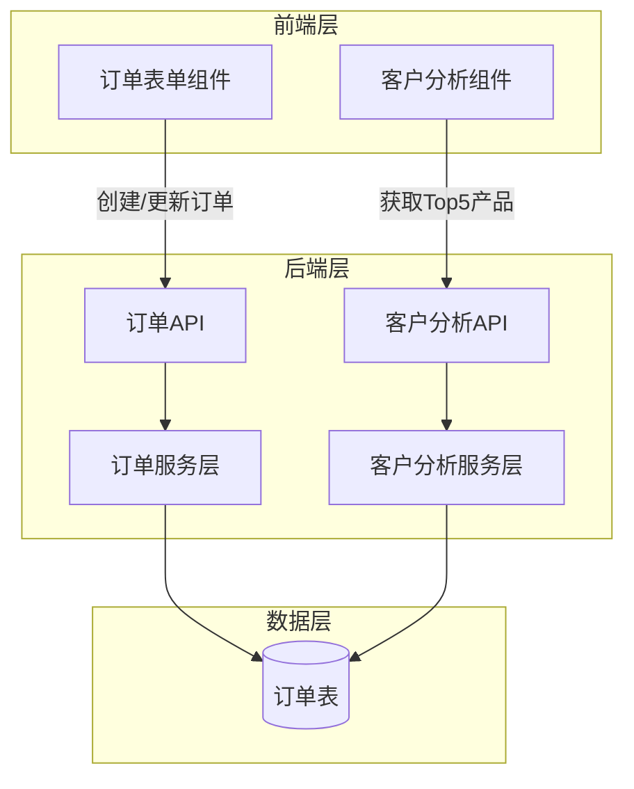

# 设计文档

## 概述

本设计文档描述订单管理系统功能增强的技术实现方案。该增强包括两个主要部分：

1. **订单表单新字段扩展**：在订单表单中添加4个新字段（客户背调、成单产品、到款日期、EXW货值），涉及前端UI、后端API和数据库架构的修改。

2. **客户分析模块增强**：在采购习惯分析部分添加Top5成单产品排行榜展示功能。

该设计采用三层架构模式，确保前端、后端和数据库层的清晰分离，便于维护和扩展。

## 架构

### 系统架构图



### 架构说明

- **前端层**：负责用户交互和数据展示
  - 订单表单组件：处理订单数据的输入和验证
  - 客户分析组件：展示客户采购习惯分析数据

- **后端层**：负责业务逻辑和数据处理
  - 订单API：提供订单CRUD操作的RESTful接口
  - 客户分析API：提供客户分析数据的查询接口
  - 服务层：封装业务逻辑和数据访问

- **数据层**：负责数据持久化
  - 订单表：存储订单信息，包括新增的4个字段

## 组件和接口

### 1. 前端组件

#### 1.1 订单表单组件（OrderForm）

**职责**：
- 渲染订单表单UI，包括新增的4个字段
- 处理用户输入和表单验证
- 提交订单数据到后端API

**新增字段UI规格**：

| 字段名称 | 字段类型 | 是否必填 | UI组件 | 验证规则 |
|---------|---------|---------|--------|---------|
| 客户背调 | 文本 | 否 | 文本输入框 | 无特殊限制 |
| 成单产品 | 文本 | 是 | 文本输入框 | 非空验证 |
| 到款日期 | 日期 | 否 | 日期选择器 | 有效日期格式 |
| EXW货值 | 数值 | 否 | 数字输入框 | 数值格式验证 |

**接口方法**：
```typescript
interface OrderFormData {
  // 现有字段...
  customerBackgroundCheck?: string;
  closedProduct: string;  // 必填
  paymentDate?: Date;
  exwValue?: number;
}

// 表单验证
function validateOrderForm(data: OrderFormData): ValidationResult {
  // 验证成单产品非空
  // 验证到款日期格式
  // 验证EXW货值为有效数值
}

// 提交订单
function submitOrder(data: OrderFormData): Promise<OrderResponse>
```

#### 1.2 客户分析组件（CustomerAnalysis）

**职责**：
- 在采购习惯分析部分展示Top5成单产品排行榜
- 处理数据加载状态和错误状态
- 提供友好的空状态展示

**UI规格**：
- 标题："Top5成单产品"
- 展示格式：排行榜列表，包含产品名称和采购次数
- 加载状态：显示加载指示器
- 错误状态：显示错误消息和重试按钮
- 空状态：显示"暂无成单产品数据"提示

**接口方法**：
```typescript
interface TopProduct {
  productName: string;
  count: number;
  rank: number;
}

interface TopProductsResponse {
  products: TopProduct[];
  totalCount: number;
}

// 获取Top5成单产品
function fetchTopProducts(customerId: string): Promise<TopProductsResponse>
```

### 2. 后端API接口

#### 2.1 订单API

**创建订单**
```
POST /api/orders
Content-Type: application/json

Request Body:
{
  // 现有字段...
  "customerBackgroundCheck": "string (optional)",
  "closedProduct": "string (required)",
  "paymentDate": "ISO 8601 date string (optional)",
  "exwValue": "number (optional)"
}

Response:
200 OK
{
  "orderId": "string",
  "message": "订单创建成功"
}

400 Bad Request
{
  "error": "成单产品字段不能为空"
}
```

**更新订单**
```
PUT /api/orders/{orderId}
Content-Type: application/json

Request Body: (同创建订单)

Response: (同创建订单)
```

**获取订单详情**
```
GET /api/orders/{orderId}

Response:
200 OK
{
  "orderId": "string",
  // 现有字段...
  "customerBackgroundCheck": "string",
  "closedProduct": "string",
  "paymentDate": "ISO 8601 date string",
  "exwValue": "number"
}
```

#### 2.2 客户分析API

**获取Top5成单产品**
```
GET /api/customers/{customerId}/top-products?limit=5

Response:
200 OK
{
  "products": [
    {
      "productName": "string",
      "count": "number",
      "rank": "number"
    }
  ],
  "totalCount": "number"
}

404 Not Found
{
  "error": "客户不存在"
}

500 Internal Server Error
{
  "error": "服务器错误"
}
```

### 3. 后端服务层

#### 3.1 订单服务（OrderService）

**职责**：
- 处理订单业务逻辑
- 验证订单数据
- 与数据库交互

**核心方法**：
```typescript
class OrderService {
  // 创建订单
  async createOrder(orderData: OrderData): Promise<Order> {
    // 1. 验证必填字段（成单产品）
    // 2. 验证数据格式（日期、数值）
    // 3. 插入数据库
    // 4. 返回创建的订单
  }
  
  // 更新订单
  async updateOrder(orderId: string, orderData: OrderData): Promise<Order> {
    // 1. 验证订单存在
    // 2. 验证数据
    // 3. 更新数据库
    // 4. 返回更新后的订单
  }
  
  // 获取订单详情
  async getOrder(orderId: string): Promise<Order> {
    // 1. 从数据库查询订单
    // 2. 返回订单数据（包括新字段）
  }
}
```

#### 3.2 客户分析服务（CustomerAnalysisService）

**职责**：
- 查询客户的订单数据
- 聚合和统计成单产品数据
- 返回Top5排行榜

**核心方法**：
```typescript
class CustomerAnalysisService {
  // 获取Top5成单产品
  async getTopProducts(customerId: string, limit: number = 5): Promise<TopProduct[]> {
    // 1. 查询客户的所有订单
    // 2. 提取成单产品字段（非空）
    // 3. 按产品名称分组并计数
    // 4. 按计数降序排序
    // 5. 取前N个（默认5个）
    // 6. 返回结果
  }
}
```

**聚合算法**：
```
输入：customerId, limit
输出：TopProduct[]

步骤：
1. 查询：SELECT closed_product FROM orders WHERE customer_id = ? AND closed_product IS NOT NULL
2. 聚合：使用Map<string, number>统计每个产品的出现次数
3. 排序：将Map转换为数组并按count降序排序
4. 截取：取前limit个元素
5. 格式化：添加rank字段（1-based）
6. 返回结果
```

## 数据模型

### 订单表（orders）

**现有字段**（保持不变）：
- `order_id` (主键)
- `customer_id` (外键)
- `order_date`
- `status`
- ... (其他现有字段)

**新增字段**：

| 字段名 | 数据类型 | 约束 | 说明 |
|-------|---------|------|------|
| `customer_background_check` | TEXT | NULL | 客户背调信息 |
| `closed_product` | VARCHAR(255) | NOT NULL | 成单产品（必填） |
| `payment_date` | DATE | NULL | 到款日期 |
| `exw_value` | DECIMAL(15,2) | NULL | EXW货值 |

**数据库迁移脚本**：
```sql
ALTER TABLE orders
ADD COLUMN customer_background_check TEXT,
ADD COLUMN closed_product VARCHAR(255) NOT NULL,
ADD COLUMN payment_date DATE,
ADD COLUMN exw_value DECIMAL(15,2);

-- 为closed_product字段添加索引（用于Top5查询优化）
CREATE INDEX idx_orders_closed_product ON orders(closed_product);

-- 为customer_id和closed_product组合添加索引（用于客户分析查询优化）
CREATE INDEX idx_orders_customer_product ON orders(customer_id, closed_product);
```

**注意事项**：
- 由于需求明确不需要考虑旧数据兼容，新增的`closed_product`字段直接设置为NOT NULL
- 如果表中已有数据，需要先为现有记录设置默认值或清空表后再添加NOT NULL约束
- 添加索引以优化Top5产品查询性能

### 数据示例

```json
{
  "orderId": "ORD-2024-001",
  "customerId": "CUST-001",
  "orderDate": "2024-01-15",
  "status": "completed",
  "customerBackgroundCheck": "已完成背景调查，信用良好",
  "closedProduct": "工业传感器 Model-X200",
  "paymentDate": "2024-01-20",
  "exwValue": 15000.50
}
```

## 正确性属性

*属性是一个特征或行为，应该在系统的所有有效执行中保持为真——本质上是关于系统应该做什么的正式陈述。属性作为人类可读规范和机器可验证正确性保证之间的桥梁。*


### 属性 1：订单数据完整性（Round-trip）

*对于任何*包含新字段的有效订单数据，创建订单后立即查询该订单，返回的数据应该包含所有新字段且值保持一致。

**验证需求：需求 1.7, 3.4**

### 属性 2：成单产品必填验证

*对于任何*缺少成单产品字段或成单产品为空的订单数据，系统的任何层（前端验证、API验证、数据库约束）都应该拒绝该操作并返回明确的错误信息。

**验证需求：需求 1.5, 2.6, 3.3**

### 属性 3：新字段API处理

*对于任何*包含新字段（客户背调、成单产品、到款日期、EXW货值）的有效订单数据，API的创建和更新操作都应该成功处理并正确存储这些字段。

**验证需求：需求 3.1, 3.2**

### 属性 4：日期格式验证

*对于任何*包含无效日期格式的"到款日期"字段的请求，API应该拒绝该请求并返回400错误和描述性错误消息。

**验证需求：需求 3.5**

### 属性 5：数值格式验证

*对于任何*包含无效数值格式的"EXW货值"字段的请求，API应该拒绝该请求并返回400错误和描述性错误消息。

**验证需求：需求 3.6**

### 属性 6：Top5产品统计正确性

*对于任何*客户和该客户的订单集合，Top5成单产品统计应该：
- 只统计非空的成单产品字段
- 按产品名称正确分组并计算出现次数
- 返回按频次降序排列的结果
- 每个结果项包含产品名称和出现次数

**验证需求：需求 4.2, 4.3, 5.1, 5.2, 5.3, 5.4, 5.5**

### 属性 7：Top5产品排序单调性

*对于任何*Top5成单产品结果列表，列表中相邻两个产品的出现次数应该满足：前一个产品的次数 >= 后一个产品的次数（降序排列）。

**验证需求：需求 4.3**

### 属性 8：Top5产品数量限制

*对于任何*客户，当该客户的成单产品种类少于5种时，返回的Top产品列表长度应该等于实际产品种类数量；当产品种类大于等于5种时，返回的列表长度应该等于5。

**验证需求：需求 4.4**

## 错误处理

### 1. 前端错误处理

**表单验证错误**：
- 成单产品为空：显示"成单产品为必填项"
- 到款日期格式无效：显示"请选择有效的日期"
- EXW货值格式无效：显示"请输入有效的数值"

**API请求错误**：
- 400错误：显示服务器返回的具体错误消息
- 500错误：显示"服务器错误，请稍后重试"
- 网络错误：显示"网络连接失败，请检查网络"

### 2. 后端错误处理

**输入验证错误**（返回400）：
- 成单产品缺失或为空
- 日期格式无效
- 数值格式无效
- 必填字段缺失

**业务逻辑错误**（返回404/409）：
- 订单不存在（404）
- 客户不存在（404）

**系统错误**（返回500）：
- 数据库连接失败
- 数据库操作异常
- 未预期的系统错误

**错误响应格式**：
```json
{
  "error": "错误消息",
  "code": "ERROR_CODE",
  "details": {
    "field": "字段名",
    "message": "具体错误描述"
  }
}
```

### 3. 数据库错误处理

**约束违反**：
- NOT NULL约束：成单产品字段为空时拒绝操作
- 外键约束：客户ID不存在时拒绝操作

**错误传播**：
- 数据库错误应该被服务层捕获并转换为适当的HTTP错误响应
- 不应该将数据库内部错误直接暴露给前端

## 测试策略

### 1. 单元测试

**前端组件测试**：
- 测试订单表单渲染是否包含所有新字段
- 测试表单验证逻辑（成单产品必填、日期格式、数值格式）
- 测试客户分析组件渲染Top5排行榜
- 测试加载状态、错误状态、空状态的UI展示

**后端服务测试**：
- 测试订单服务的创建、更新、查询方法
- 测试客户分析服务的Top5统计算法
- 测试输入验证逻辑
- 测试错误处理逻辑

**数据访问层测试**：
- 测试数据库schema是否包含所有新字段
- 测试NOT NULL约束是否生效
- 测试索引是否创建成功

### 2. 属性测试

属性测试使用随机生成的测试数据来验证系统的通用属性。每个属性测试应该运行至少100次迭代。

**测试库选择**：
- 使用 Jest 进行单元测试
- 使用 fast-check 进行属性测试
- 使用 Supertest 进行API集成测试

**属性测试配置**：
```typescript
// 示例：使用fast-check进行属性测试
import fc from 'fast-check';

// 每个属性测试运行100次
fc.assert(
  fc.property(
    // 生成器...
    (testData) => {
      // 测试逻辑...
    }
  ),
  { numRuns: 100 }
);
```

**属性测试标签格式**：
```typescript
// Feature: order-fields-and-analysis-enhancement, Property 1: 订单数据完整性（Round-trip）
test('Property 1: Order data round-trip consistency', () => {
  // 测试实现...
});
```

**需要实现的属性测试**：

1. **属性1测试**：生成随机订单数据（包含新字段），创建后查询，验证数据一致性
   - **Feature: order-fields-and-analysis-enhancement, Property 1: 订单数据完整性（Round-trip）**

2. **属性2测试**：生成缺少成单产品的订单数据，验证系统拒绝操作
   - **Feature: order-fields-and-analysis-enhancement, Property 2: 成单产品必填验证**

3. **属性3测试**：生成包含所有新字段的随机订单数据，验证API正确处理
   - **Feature: order-fields-and-analysis-enhancement, Property 3: 新字段API处理**

4. **属性4测试**：生成无效日期格式，验证API拒绝请求
   - **Feature: order-fields-and-analysis-enhancement, Property 4: 日期格式验证**

5. **属性5测试**：生成无效数值格式，验证API拒绝请求
   - **Feature: order-fields-and-analysis-enhancement, Property 5: 数值格式验证**

6. **属性6测试**：生成随机客户和订单数据，验证Top5统计的正确性
   - **Feature: order-fields-and-analysis-enhancement, Property 6: Top5产品统计正确性**

7. **属性7测试**：生成随机订单数据，验证Top5结果的排序单调性
   - **Feature: order-fields-and-analysis-enhancement, Property 7: Top5产品排序单调性**

8. **属性8测试**：生成不同数量的产品数据，验证返回列表长度正确
   - **Feature: order-fields-and-analysis-enhancement, Property 8: Top5产品数量限制**

### 3. 集成测试

**API集成测试**：
- 测试完整的订单创建流程（前端 → API → 数据库）
- 测试完整的订单更新流程
- 测试完整的Top5查询流程
- 测试错误场景的端到端处理

**数据库集成测试**：
- 测试数据库迁移脚本执行成功
- 测试索引创建和查询性能
- 测试约束在实际数据库中的执行

### 4. 测试数据生成

**订单数据生成器**：
```typescript
// 生成有效的订单数据
function generateValidOrder() {
  return {
    customerId: randomCustomerId(),
    orderDate: randomDate(),
    status: randomStatus(),
    customerBackgroundCheck: randomText(),
    closedProduct: randomProductName(), // 必填
    paymentDate: randomDate(),
    exwValue: randomDecimal(0, 1000000)
  };
}

// 生成无效的订单数据（缺少成单产品）
function generateInvalidOrder() {
  return {
    ...generateValidOrder(),
    closedProduct: null // 或 undefined
  };
}
```

### 5. 测试覆盖率目标

- 单元测试代码覆盖率：≥ 80%
- 属性测试：覆盖所有8个正确性属性
- 集成测试：覆盖所有主要用户流程
- 边界情况测试：覆盖空数据、最大值、最小值等边界情况

## 实现注意事项

### 1. 性能优化

**数据库查询优化**：
- 为`closed_product`字段添加索引，优化Top5查询
- 为`(customer_id, closed_product)`组合添加复合索引
- 考虑使用数据库的聚合函数（GROUP BY, COUNT）而不是在应用层聚合

**缓存策略**：
- 考虑对Top5产品数据进行缓存（如使用Redis）
- 设置合理的缓存过期时间（如5分钟）
- 当订单更新时清除相关客户的缓存

### 2. 数据迁移

**迁移步骤**：
1. 备份现有数据库
2. 在测试环境执行迁移脚本
3. 验证迁移结果
4. 在生产环境执行迁移
5. 验证生产环境数据完整性

**回滚计划**：
```sql
-- 如果需要回滚
ALTER TABLE orders
DROP COLUMN customer_background_check,
DROP COLUMN closed_product,
DROP COLUMN payment_date,
DROP COLUMN exw_value;

DROP INDEX idx_orders_closed_product;
DROP INDEX idx_orders_customer_product;
```

### 3. 可扩展性

**字段扩展**：
- 设计时考虑未来可能添加更多字段
- 使用灵活的数据模型和API设计

**功能扩展**：
- Top5功能可以扩展为TopN（通过参数控制）
- 可以添加更多维度的客户分析功能

## 当前技术栈

本系统使用以下技术栈：

**前端**：
- React 18 + TypeScript - 提供类型安全和组件化开发
- Ant Design - 提供丰富的企业级组件（表单、表格、日期选择器等）
- React Context API - 状态管理，适合中小型应用
- Axios - HTTP客户端，简化API调用和错误处理

**后端**：
- Node.js + Express - 轻量级、高性能的RESTful API框架
- TypeScript - 类型安全的JavaScript超集

**数据库**：
- SQLite3 - 无需独立服务器，适合单机部署
- better-sqlite3 - 同步API的SQLite驱动，性能优于异步sqlite3

**测试**：
- Jest - JavaScript/TypeScript单元测试框架
- fast-check - 属性测试库
- Supertest - API集成测试库
